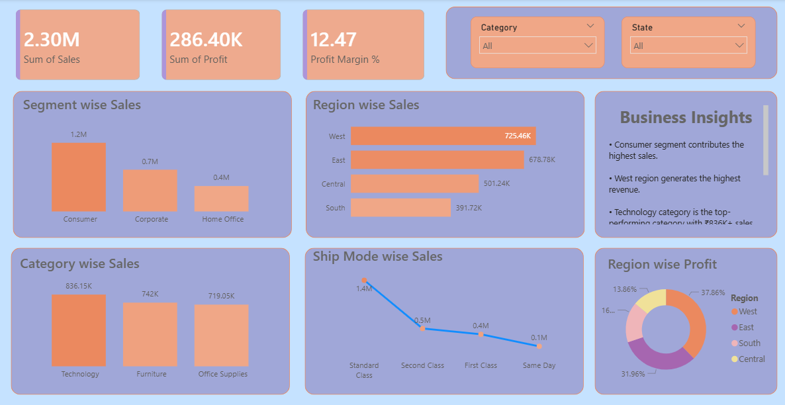

# 📊 Business Sales Dashboard

## 🚀 Overview
This project is an interactive **Business Sales Dashboard** designed to provide key insights into sales performance, profitability, and regional trends. It helps stakeholders quickly understand business performance through clear visualizations.

---

## 📌 Key Metrics
- **Total Sales:** 2.30M  
- **Total Profit:** 286.40K  
- **Profit Margin:** 12.47%  

---

## 📈 Features

### 🔹 Sales Analysis
- Segment-wise Sales (Consumer, Corporate, Home Office)
- Category-wise Sales (Technology, Furniture, Office Supplies)

### 🌍 Regional Insights
- Region-wise Sales (West, East, Central, South)
- Region-wise Profit Distribution

### 🚚 Shipping Analysis
- Ship Mode-wise Sales:
  - Standard Class
  - Second Class
  - First Class
  - Same Day

### 🧠 Business Insights
- Consumer segment contributes the highest sales  
- West region generates the highest revenue  
- Technology is the top-performing category  

---

## 🎛️ Filters
- **Category Filter**
- **State Filter**

These allow dynamic exploration of the data.

---

## 🛠️ Tools & Technologies
- Data Visualization Tool (Power BI)
- Data Processing: Excel 
- Dashboard Design Principles

---

## 📷 Dashboard Preview
The dashboard provides a clean and interactive interface for analyzing:
- Sales trends
- Profit distribution
- Regional performance

---

## 💡 Use Cases
- Business performance tracking  
- Sales strategy optimization  
- Data-driven decision making  

---

## 📬 Contact
If you have any questions or suggestions, feel free to reach out!
